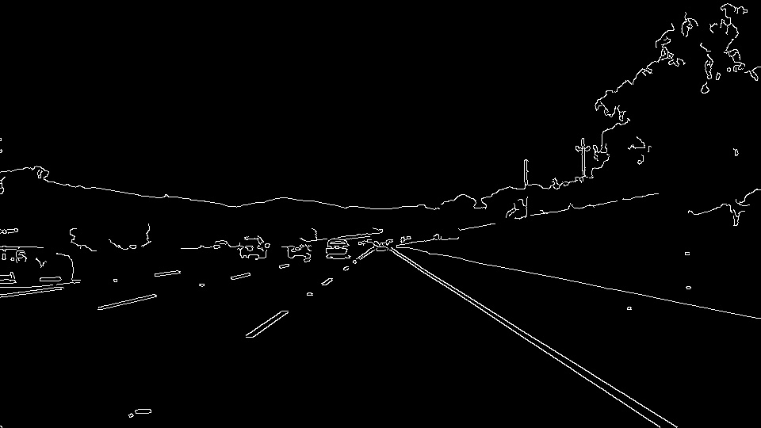
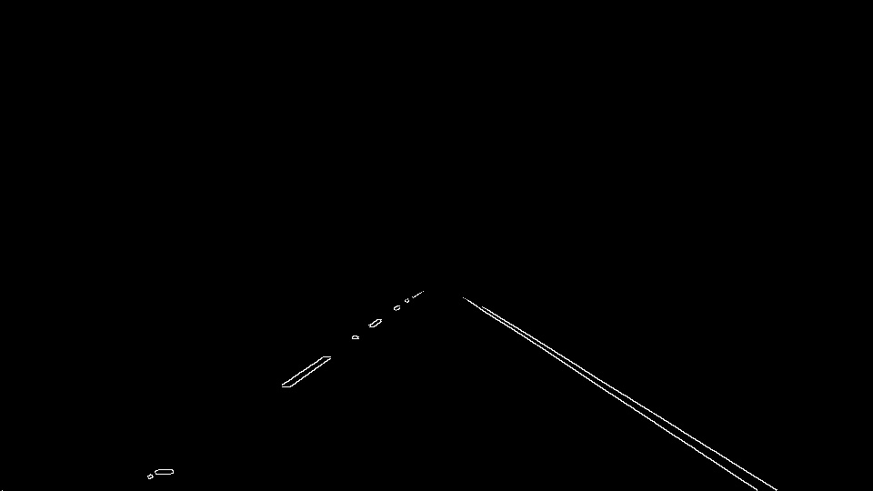
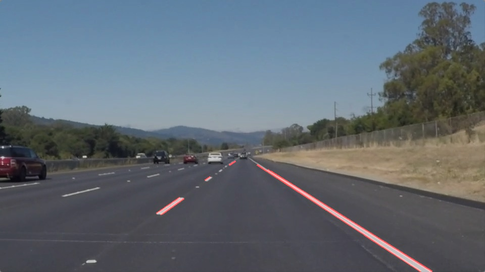
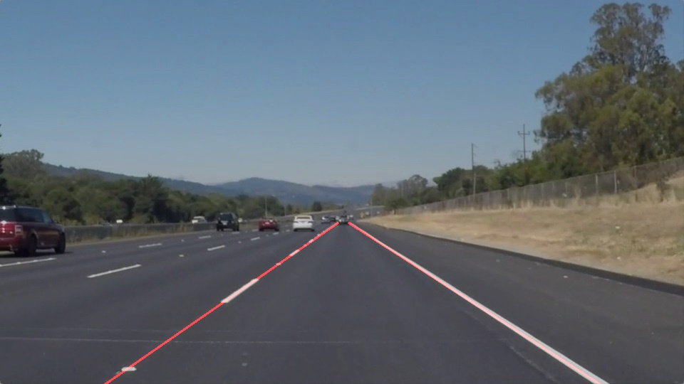

# Finding Lanes In Videos

## Overview
Finding lane line is a important task in developing autonomous driving systems. With this projecta pipe line has been implemeted to detect the lane lines in sequence of images (video). The appraoch is using simple image processing thechniques such as edge detection and Hough Transfomation. In real atonomous driving systems more advanced and robust methods are being utulized to perfrom this task.

### Code description

Each frame of the video will processed with individually; therefore, the code is only explained for a single image.

1. First the pipeline reads the image

2. Then in order to use canny edge detection the RGB image will be converted to a gray scale image.

3. Afterwards a Gaussian blurring (smoothing) will be applied on the image to filter out the noise. By doing so the noise will be attenuated in the image and the canny edge, detection will not capture the noise instead of real edges.

4. In the next stage, the canny edge will find the edges in the image. The thresholds have to be tuned to only detect the strong edges in the image.

5. At this stage of the image processing pipeline, unrelated edges are included in the image. Therefore, the region of the interest should be selected to filter out the undesired edges. It is assumed that the camera is setup in a specific location and the edges associated with the lane lines will always appear in a specific region in the sequence of images captured by the camera. The filtered edge image is shown below:

6. In the next stage, the Hough transform is used to detect the line segments in the edge image. Any line in Hough space represents a point and the Hough transform can detect the pixels associated with a line based on a voting system. 

7. At this point discrete line segments are identified by Hough transform. In order to obtain a continuous representation of the left and right lanes an averaging and extrapolating procedure will be added to the image-processing pipeline. First, the line segments will be classified and assigned to the left and right lanes based on the sign of their slope. Afterwards, each of line classes (left or right) will be averaged to narrow down the line candidates to one for each of the left or right lane. At the end, the final lanes will be extrapolated from the bottom of the image to a desired height in the image.

### Some of the draw backs of the approach

1. The initial parameters and threshold of this pipeline should be tuned carefully, and may fail to process all kinds of vides.

2. The curved lines are hard to handle using this approach because of the version of the Hough transform that we are using is only good for straight lines.

3. The location of the cameras is assumed to be fixed for all the videos, that may change from case to case. Having a different field of view for the camera can be a problem that is not considered in the designed pipeline.
